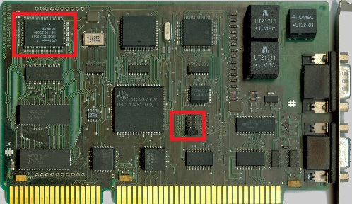
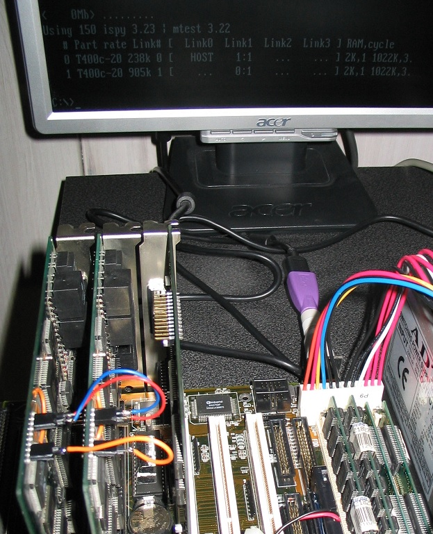
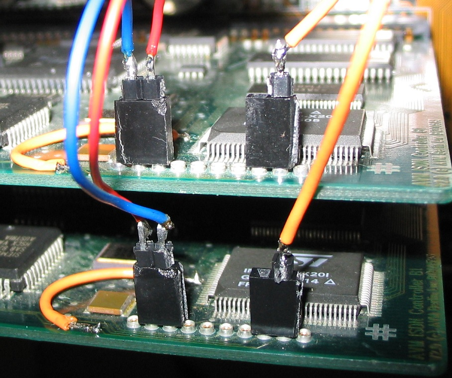

<html>
<head>
<link rel="stylesheet" href="../style.css" type="text/css">
</head>
<body>
<h1>Transputer</h1>
Links: 
http://www.transputer.net/ 
https://sites.google.com/site/transputeremulator/ 
http://www.wehavemorefun.de/fritzbox/ISDN-Controller_B1_PCI 
http://jonathanschilling.de/content/elektrotechnik/computerbasteln/transputer/avm_b1 
http://www.classiccmp.org/transputer/software/languages/occam/compilers/inmos/commercial/ 
http://www.geekdot.com/avm-b1.html http://www.classiccmp.org/transputer/ 
 
Viele Informationen hier sind durch die Arbeiten von <b>Axel Muhr</b> &amp; <b>Jonathan Schilling</b> erst ermöglicht worden! 
Siehe auch ihre Seiten unter Links. 
 
Transputer waren spezielle Chips/CPU's der Firma INMOS zur hoch parallelen Datenverarbeitung. 
Transputer Chips konnten über schnelle Link-Verbindungen zu Clustern aufgebaut werden. 
Als Hochsprache, die parallel Prozesse unterstützt wurde damals Occam entwickelt. 
Die Chips und Rechnerboards kamen ab 1983 auf dem Markt. Heute sind solche Boards nur noch sehr schwer zu bekommen und sehr teuer – mit Ausnahme..  
 
Aber auf einer alten ISDN Karte B1 von AVM ist ein T400 Transputer Chip drauf und die Karte ist sogar registerkompatibel zur originalen INMOS B004 Karte! 
 
Der AVM B1 ist ein aktiver ISDN-Controller und bis Version 3.0 für den ISA-Bus gebaut.  
Bis Version 3.0 wird ein Transputer vom Typ T400 verwendet. V1+V2 sind geeignet. 
 
Bild AVB-B1 V2: 
(Pin-Anschlussreihe links nach rechts: 1-2-3-4-5-6-7-8-9-10) 
 
 Auf der linken Seite der Karte findet sich ein kleines Transputer-System mit T400 Transputer Chip (rechts oben rot markiert) und 1MB RAM sowie einem 
TRAM-ähnlichen Erweiterungsinterface. Rechts unten auf der Karte sitzt der C011, der auf den 4 jumperbaren Adressen (Mitte unten rot markiert) vom ISA-Bus 
aus angesprochen werden kann. Die Standardadresse sollte 0x150 sein! Der C011 ist auf der B1 fest auf Link 0 des T400 verdrahtet. Die Links sind von AVM 
auf der Platine auf 10MBit/s verdrahtet. 
 
Also alten DOS Rechner mit ISA Slots aufsetzen, Karte rein und schon hat man seinen eigenen, kleinen Transputer zuhause. 
 
Auf: http://www.wizzy.com/wizzy/ispy.html 
 
Gibt es die Tools ispy und mtest. Mit eingesetzter B1 Karte und Adressjumper auf 0x150 gesetzt, sollte eine Aufruf von ispy | mtest in der DOS Kommandozeile 
etwa folgende Rückmeldung erzeugen: 
 &gt; ispy | mtest Using 150 ispy 3.21 | mtest 3.21  
# Part rate Link# [ Link0 Link1 Link2 Link3 ] RAM,cycle  0 T400b-20 43k 0 [ HOST ... ... ... ] 2K,1 1022K,6. 
 
So einfach hat man ein funktionierendes Transputersystem! Das Mandelbrot Programm kann so direkt gestartet werden und alles passt auf eine FreeDOS Bootdiskette 1,44MB. 
 
<a href="./Transp.zip">Transp.zip</a> 
 
Übersetzte (Occam) Programme werden mit iserver.exe ausgeführt. Eine Batchdatei iserv.bat setzt dazu notwendige Umgebungsvariablen!
 
set IBOARDSIZE=#100000 
set TRANSPUTER=#150 
iserver.exe /SB %1 %2 %3   
   
Man kann sogar 2 AVM B1 Karten in einem PC als kleines Transputer-Cluster betreiben. Eine Karte wird auf 0x150 gejumpert, die andere z.B. auf 0x160 
(damit wird sie ersteinmal nicht erkannt von der PC Software). Beide Karten werden nun über 3 kurze Verbindungen miteinander verbunden: 
(Dabei wird vorher der Reset-Pin auf Pin 2 der 10-poligen Leiste verdrahtet, wie auf J.Schillings Seite beschrieben) 
 Link1in(1) &lt;- Link1out(2) (Pin 8) Link1out(1) -&gt; Link1in(2) (Pin 9) Reset(1) &lt;-&gt; 
Reset(2)&nbsp;&nbsp;&nbsp;&nbsp; (Pin 2) 
 
Bild des Aufbaus und ispy Anzeige:  
 
Bild der Verbindungen:  
 
</body>
</html>
